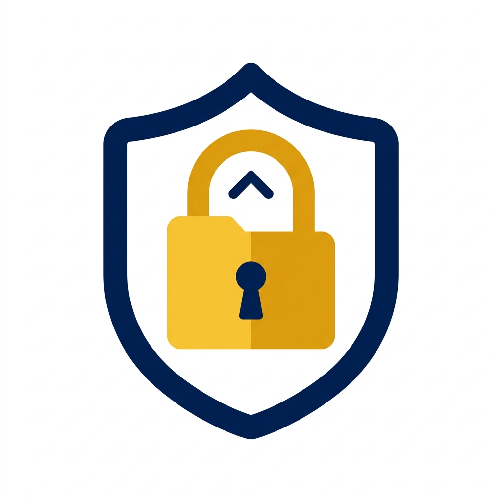

<div align="center">
  
  <h1>VaultPass Desktop</h1>
  <p><strong>Your passwords stay on your computer. No cloud. No accounts. 100% offline.</strong></p>
  <p>A fast, private desktop password manager built with Kotlin and Jetpack Compose.</p>
</div>

---

## What is VaultPass Desktop?

VaultPass Desktop is a private, local-only password manager for your PC. It works completely offline: your data is encrypted on your machine and never touches the internet or a cloud server.

It also connects directly with **VaultPass for Android** over your local Wi-Fi, allowing you to sync credentials between your phone and computer without third-party services.

---

## Who is this for?

* Anyone tired of cloud leaks, online accounts, and subscription fees.
* Users who want their passwords stored only on hardware they physically own.
* People who want to sync between phone and computer over home Wi-Fi privately.
* Anyone working in offline, air-gapped, or restricted environments.

---

## Key Features

### Total Offline Privacy
* Works 100% offline. No telemetry, no accounts, no cloud dependencies.
* Strong local encryption keeps your master vault unreadable to anyone else.
* Sensitive keys are wiped from system memory the moment the app locks.

### Direct Phone-to-PC Sync
* Pair with your Android phone in seconds by scanning a QR code.
* Sync directly across your local Wi-Fi network without leaving your house.
* Side-by-side review screen lets you preview every change before merging.

### Easy Password Management
* Store logins, secure notes, custom fields, and password histories.
* Built-in password generator creates strong, random passwords instantly.
* Fast search to find credentials immediately.

### Security Health Check
* Built-in Security Center audits your vault in real time.
* Instantly spots weak passwords, reused credentials, and vulnerable accounts.

### Simple Migration
* Import existing passwords directly from Bitwarden, KeePass, or CSV files.
* Export your data anytime in encrypted or open formats for personal backups.

---

## How to Clone and Run

You only need **Git** and **Java (JDK 17 or newer)** installed on your computer.

### 1. Clone the repository

```bash
git clone https://github.com/ArmaanCode2/vault-pass-desktop.git
cd vault-pass-desktop
```

### 2. Run the application

**Windows (PowerShell or Command Prompt):**
```powershell
.\gradlew.bat run
```

**macOS or Linux:**
```bash
./gradlew run
```

On first launch, you will be prompted to create your master password and set up your local vault.

---

## Mobile Companion

VaultPass Desktop works seamlessly alongside **VaultPass Android**. Both applications share the same offline philosophy and sync directly over local Wi-Fi.

---

## License

This project is licensed under the repository terms. See the LICENSE file for details.
