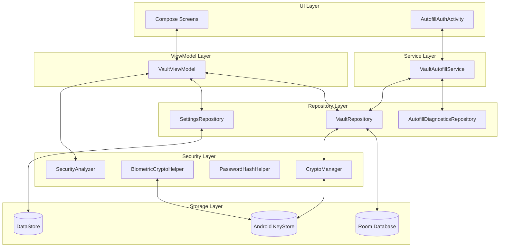
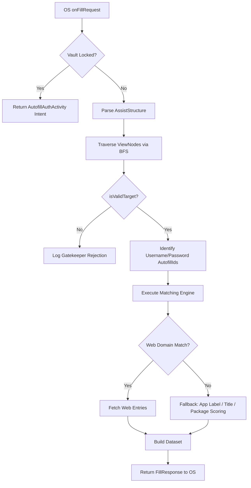
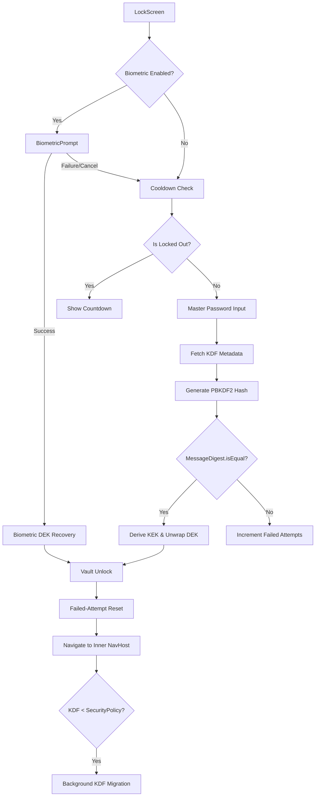
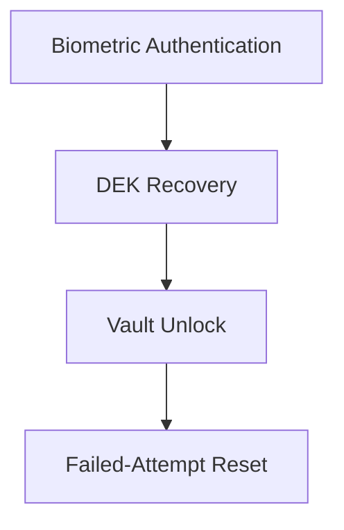
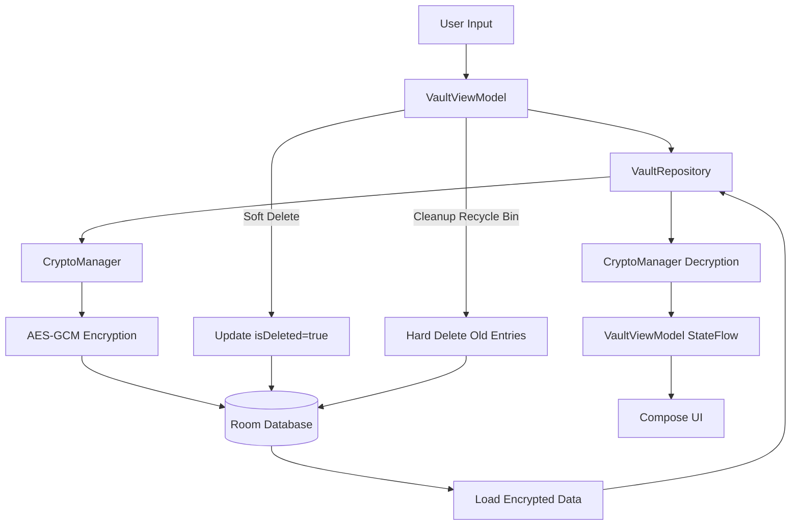
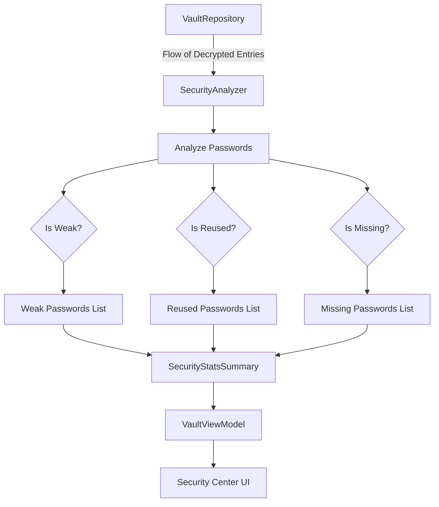
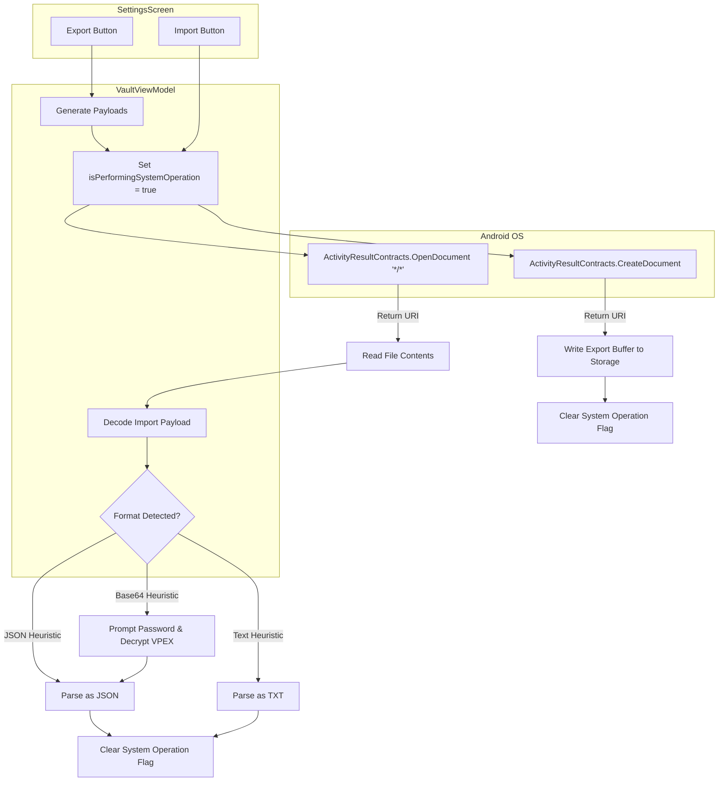
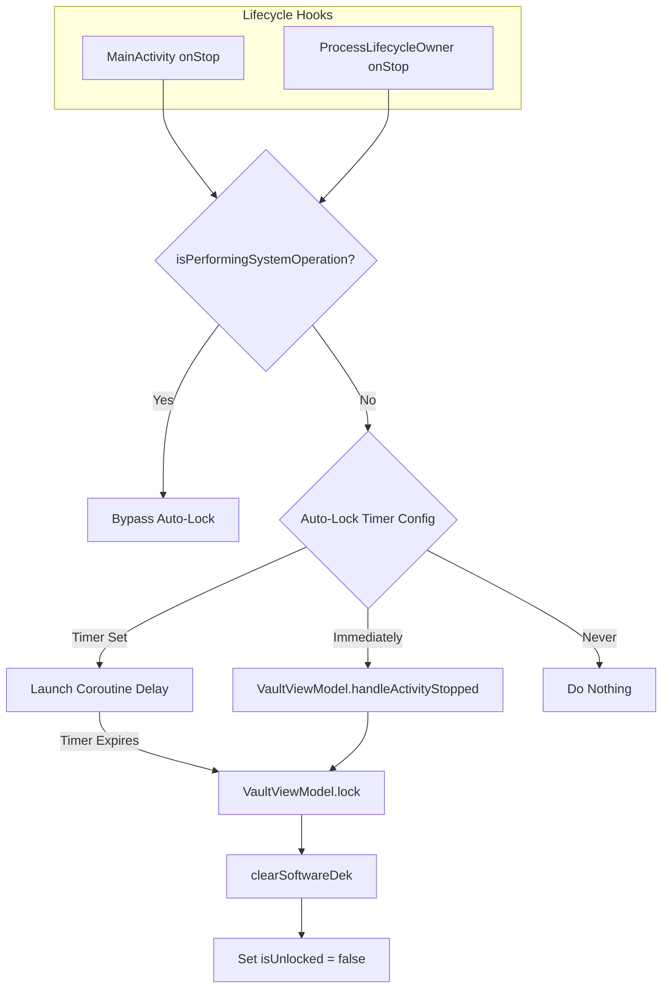

# VaultPass Architecture

VaultPass is built on a highly modular MVVM architecture emphasizing separation of concerns and rigorous security isolation. This document outlines the core structural domains of the application and their specific workflows.

## 1. High-Level Architecture Diagram

## 2. Structural Layers

### Repository Layer
* **VaultRepository**: Manages all CRUD operations for credentials. It sits directly above the Room DAO and securely routes payloads through the Crypto Layer before persistence. Implements a soft-delete mechanism (`isDeleted = true`) instead of hard deletion to power the Recycle Bin.
* **SettingsRepository**: Manages user preferences and security configurations via Jetpack DataStore (e.g., Biometric Wrapper, Theme).
* **AutofillDiagnosticsRepository**: A specialized runtime logger that buffers telemetric data during headless Autofill parsing for real-time UI debugging.

### Crypto Layer
* **CryptoManager**: Handles purely software-based AES-GCM cryptography for Database records and Import/Export payloads.
* **BiometricCryptoHelper**: Handles Hardware-Backed keystore constraints, generating the `CryptoObject` Ciphers necessary for Biometric unlocks.

## 3. Autofill Architecture Diagram
The Autofill framework operates completely headless. It parses Android's DOM, matches records, and serves datasets seamlessly.

## 4. Authentication Flow Diagram

### Biometric Flow (Detailed)

## 4.5. KDF Architecture & Migration
VaultPass uses a dynamic Key Derivation Function (KDF) architecture tracking multiple variables securely via DataStore:

### KDF Parameters
* `MASTER_HASH`: The derived master key hash for password verification.
* `MASTER_SALT`: Cryptographic salt for the KDF.
* `MASTER_KDF_VERSION`: Internal schema version of the KDF.
* `MASTER_KDF_ITERATIONS`: The exact iterations used to derive the KEK and Master Hash.
* `MASTER_KDF_ALGORITHM`: The algorithm used (e.g., `PBKDF2WithHmacSHA256`).

### Security Policy
A centralized `SecurityPolicy` establishes the target KDF baseline for the app (currently **PBKDF2-HMAC-SHA256 @ 300,000 iterations**). New users default directly to this standard.

### Seamless Background Migration
Legacy users are securely supported via the dynamic KDF fallback. Upon a successful login using legacy iterations (e.g., 100k), the app automatically fires a silent background coroutine:
1. Re-derives the KEK at the new `SecurityPolicy` standard (e.g., 300k).
2. Rewraps the active Software DEK using the new KEK.
3. Commits the transaction.

### Migration Architecture
* **Legacy Compatibility:** Seamlessly reads legacy 100k iteration configs.
* **Dynamic Iteration Support:** Resolves KDF parameters dynamically at runtime before deriving the PBKDF2 hash.
* **DEK Rewrapping Strategy:** Safely unwraps the old DEK, derives a new KEK using the upgraded target iterations, and rewraps the DEK.
* **Future Upgrade Support:** The structure supports painless, transparent future bumps to 600k+ iterations.
* **Two-Phase Commit Recovery:** To prevent split-brain data loss between the asynchronous `DataStore` (holding hashes) and synchronous `SharedPreferences` (holding the wrapped DEK), migrations use a Two-Phase Commit (`pending_dek_mp_wrapped_v2`). The `unlockWithPassword` flow acts as a self-healing loop: if the primary DEK unwrap fails post-crash, it successfully unwraps the `pending_v2` DEK and finalizes the commit silently.

## 4.6. Brute Force Protection Architecture

VaultPass defends against brute force dictionary attacks via a strictly enforced local penalty system.

### Lockout Mechanics
* **Failed-attempt persistence:** DataStore tracks `FAILED_AUTH_ATTEMPTS`.
* **Timestamp persistence:** DataStore tracks `LAST_FAILED_AUTH_TIMESTAMP`.
* **Cooldown calculation:** Thresholds activate dynamically based on failure volume (5 = 30s, 10 = 60s, 15 = 5m, 20+ = 15m).
* **Lockout enforcement:** App state flows evaluate remaining cooldown via `combine` operators before passing control to authentication handlers. The UI enforces lockouts via countdown timers.

### Counter Reset Logic
* **Password reset path:** Any successful master password verification guarantees an immediate reset of failed attempt counters and timestamps.
* **Biometric reset path:** A successful biometric hardware verification guarantees an immediate reset of failed attempt counters and timestamps. This ensures users relying on biometrics are not silently accumulating failures over long durations.

## 5. Data Flow Diagram

## 6. Security Analysis Flow Diagram

## 7. Import / Export Flow Diagram

## 8. Hybrid Auto-Lock Lifecycle Flow Diagram

## 9. Theme Architecture
VaultPass uses a strictly dynamic theme system driven by Material 3 (`MaterialTheme.colorScheme`). 
* Hardcoded colors (e.g., `#FF0000` or `Color.White`) are strictly avoided in UI surfaces to prevent contrast breakages between Light and Dark modes.

## 10. Recycle Bin Architecture

The Recycle Bin is implemented entirely via a soft-delete architecture to maintain the core security model and ensure zero data loss during mistakes, without creating unnecessary database tables.

### Database Changes
* `isDeleted`: Boolean
* `deletedAt`: Long?

### Soft Delete Flow
* Delete action marks entries as deleted (`isDeleted = true`).
* `deletedAt` timestamp recorded.
* Entry removed from normal vault queries.

### Restore Flow
* `isDeleted = false`
* `deletedAt = null`

### Permanent Delete Flow
* Entry permanently removed from database.

### Cleanup Flow
* Deleted entries automatically removed after 7 days.
* Cleanup executes during:
  * App startup
  * Successful vault unlock
  * Successful import

### Visibility Rules
To ensure strict security and logical isolation, deleted entries are strictly excluded from:
* Normal vault queries
* Autofill datasets
* Security Center analysis
* Exports

### Migration
* Handled via standard Room migration (`Migration(1, 2)`).
* Backward compatibility preserved through purely additive `ALTER TABLE` changes.

## 11. Privacy Policy Integration

Privacy Policy functionality is strictly separated from business and authentication logic.
* **Shared Utility:** `Constants.kt` holds `PRIVACY_POLICY_URL` to ensure exactly one source of truth.
* **UI Integration:** Clickable modifiers in `LockScreen` and `SettingsScreen` wrap Android's `Intent.ACTION_VIEW` targeting the `Uri.parse()` representation of the URL.
* **Failure Handling:** Wrapped in safe `try-catch` blocks to prevent crashes on devices lacking web browsers.

## 12. Database Schema and Migrations

VaultPass uses Jetpack Room (`AppDatabase`) for local persistence.
* **Current Version:** `version = 2`
* **Schema Safety:** `exportSchema = false` (Local only, offline-first)
* **Migrations:**
    * **`MIGRATION_1_2`:** Added `isDeleted` (INTEGER NOT NULL DEFAULT 0) and `deletedAt` (INTEGER DEFAULT NULL) to support the soft-delete Recycle Bin architecture.

## 13. Current Dependency Overview

*   **UI Toolkit:** Jetpack Compose (Material 3)
*   **Architecture Components:** ViewModel, Navigation Compose, Lifecycle Runtime
*   **Persistence:** Room, Jetpack DataStore (Preferences)
*   **Cryptography:** `javax.crypto` (AES, PBKDF2), Android Keystore system
*   **System Services:** Android Autofill Service, Android BiometricPrompt
